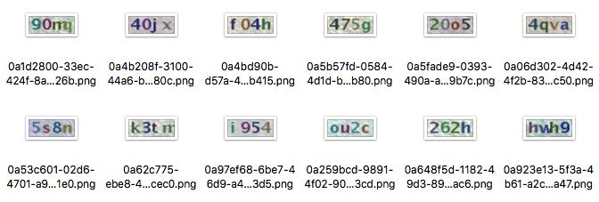
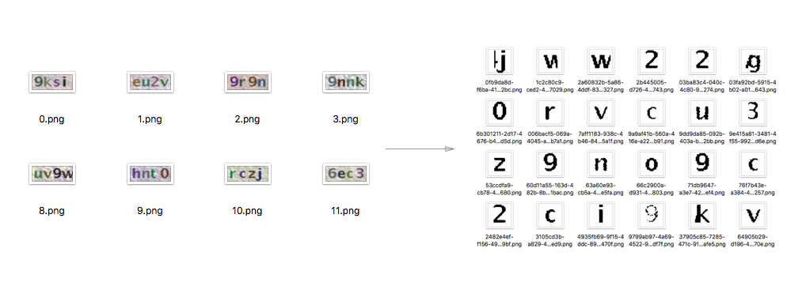
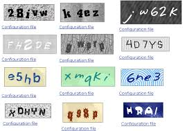
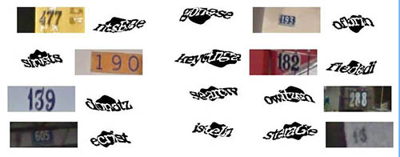
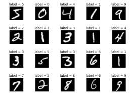
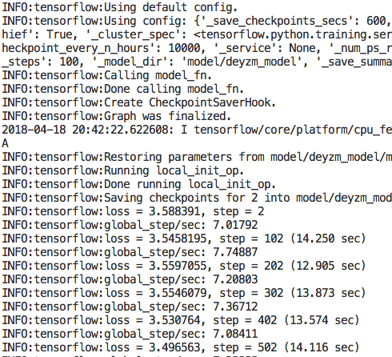
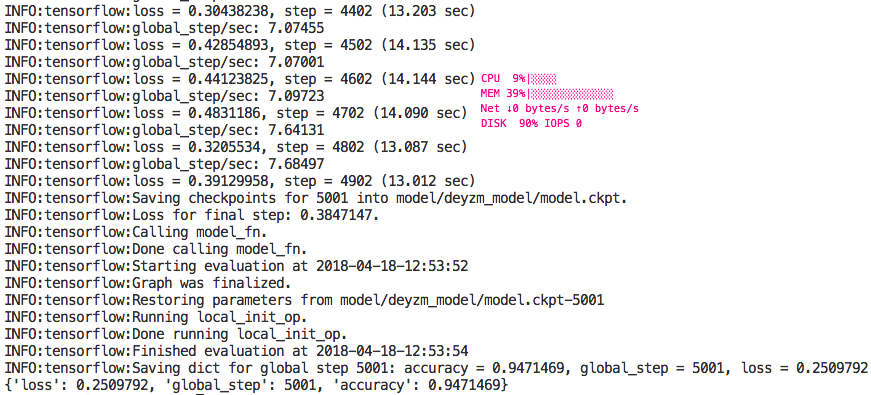
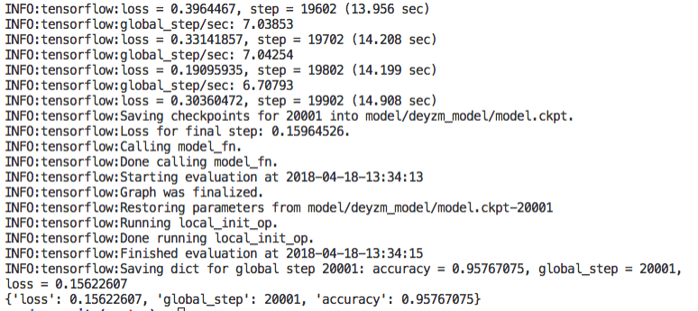

# 用CNN识别验证码的实用教程, tensorflow captcha recognization practical tutorial


本文重在实用，让你半天能搞定验证码的识别，包括从训练材料的获取、预处理和训练，以及predict服务器的搭建。


本文举例的对象（为某银行的微信服务用的,[下载训练集](https://github.com/fateleak/captcha-dataset)，[本文代码](https://github.com/fateleak/tensorflow-captcha-practice))：




### 为什么搞爬虫的时候要自己弄验证码识别？

1，省钱，打码的市场价是1分一枚，1万个码就是100块钱，如果一天10万码，那么一个月就要3W。

2，更快更可靠，打码平台经常互相掐架时常DOS，而且一个码要3秒-10秒不等，如果是凌晨时间，就更慢了。如果自己识别了，基本0.1秒识别一枚，能够加快爬虫的速度。


### 训练材料的获取

#### 到底需要多少标记好的材料？

这和验证码的形态和预处理的方式有关，按本文举例的验证码、采用分割的预处理下，5000个能达到95+。我们实用8000枚的材料，最后能够得到97.5%的正确率。（注意，本事训练材料也是有错误的，包括测试数据，所以98%左右已经是极限了）下面给个基本的量级参考：


4位数字+分割=800

4位数字字母+分割=5000

4位数字字母+整体=20000


#### 如何给训练材料打标记呢？

方法1，自己标注

3秒一个，5000枚，半天搞定。多分几个人的话，一小时搞定。

方法2，打码平台（推荐）

1分钱-2分钱一枚，5000枚只要50块钱，包括写脚本时间，估计一小时。推荐这种方法，花钱节约时间。

方法3，找到对方的验证码的生成器

很多平台生成验证码的时候一般都是找一个第三方的库来生成的，如果你也能找到对应的，那就OK了。

方法4，模拟对方的验证码生成器

如果模拟的不对，那就白忙活了。这其中包括正确的字体、干扰的线条、色彩等，对复杂点的验证码，基本是不可能1小时内能搞定的。有一个通用的思路是用类似prisma的样式迁移，但这就很费力了。


**我选择方法2，用打码平台花了50块钱，搞了1W个label的码（新用户从50送50），花了差不多1个小时。**


### 分割预处理

分割预处理，就是把4位的验证码分割开来。像这样:




那为什么要分割呢？

分割的好处是，能够降低模型的复杂度，分割后，模型就只要能够识别当个字符就可以了。这就导致：

1，那么需要的训练材料的量也相应变少了，同时一个sample也能产生4个训练材料，正反一下，需要标记的材料的量就降了很多。

2，我们可以使用更简单的CNN网络了，训练时间也更快（不需要GPU也能在半小时内训练完）


什么时候不分割呢？



像👆上图这种，都还是很简单的就可以分割的，但像下面这种（Google的）👇，变形拥挤在一起的就很难分割了。（也说明了什么样的验证码才是好的验证码）




分不了就别分了，整体训练，也算是发挥CNN能力的时候。


**我做了分割，代码是`pre.py`，一小时差不多了。至此，我们训练材料准备就绪了，还剩下4小时。**


### 搭CNN网络


#### 选择一个合适的

有很多现成的网络啊，有名的alexNet,googleNet,resNet都可以做图像分类，那我们用哪个呢，MnistNet！！就是那个分类lecun的手写数字的小网。



直观的讲，原来是0-9十个类别的手写数字变形大、和我们数字+字母共35分类但因为是非手写的，所以容量上在一个等级。


#### 修改MnistNet

我们啥都不用改，就只要改下最后一层的分类数量就行啦，从10改成10+26。（见deyzm.py）

```
	# Logits layer
    # Input Tensor Shape: [batch_size, 1024]
    # Output Tensor Shape: [batch_size, 10+26]
    logits = tf.layers.dense(inputs=dropout, units=10+26) #改成我们的分类数目
```


**改一行代码，用时30分钟够了吧。剩下3.5小时，得快点了。**


### 训练


#### 先要修改下数据加载部分

这里我们要修改下数据输入部分，因为原来的Mnist的材料是一个二进制的文件，而我们要直接从图片中读训练数据和labels，加载后的数据格式和原MnistNet的输入一模一样，咱们的加载代码（详见deyzm.py中的load_data_set）

```

def load_data_set(fn_labels):
    print('loading...  ', fn_labels)
    with open(fn_labels, 'r') as fp_label:
        ll = fp_label.readlines()
        labels = [c2i(l.split(',')[1].strip()) for l in ll ]
        labels = np.array(labels)
        print(labels.shape, labels)
        data = []
        for i, line in enumerate(ll):
            if i%1000==0:
                print('{}/{}'.format(i, len(ll)))

            line = line.strip()
            ww = line.split(',')
            data.append(read_as_array(ww[0]))

        data = np.array(data)
        data = data.reshape((-1,28*28))
        return  data, labels
```

numpy没用过同学，快去看下numpy的数据处理5分钟就能理解。[numpy快速教程](http://cs231n.github.io/python-numpy-tutorial/)


#### 开始训练

改一个参数，节约时间

```
    mnist_classifier.train(
        input_fn=train_input_fn,
        steps=5000, #原20000，实际本例到4000，loss就到底了
        hooks=[])
```

启动

```
python deyzm.py
```




启动的时候，loss在3.5，而且降的很慢。

大概在2000+step的时候，loss开始打降了，**最后5000step的时候完成训练。在测试集下面能够有95%的正确率。**



尝试跑到2W，虽然loss低了很多，但准确率没什么提高（因为训练和测试集合本身有2%的人工标注错误）


**训练结束，用时1小时（按5000step算，实际i7 4核在30分钟就跑完），没想到CPU训练这么快。剩下2.5小时。**


### 把predict做出http服务

服务器上有10个进程都要用这个验证码识别，做个http服务来响应所有的请求吧。详见`web_server.py`。

**用时10分钟，最后我们提前完成了任务，可喜可贺可喜可贺，多出来的2.35小时玩点什么不好呢，要写这个文？**


### 感想

用CNN做验证码识别大材小用了，但也不失为一个方法啦，而且实际表现确实非常好。其能力的上下限也很大，既可以识别简单的，也可以识别超级复杂的，必须是爬虫工程师的必备技能~

同时感慨下现在的anti-spaming越来越难做了，验证码如此，文字的的机器人回复评论已经和正常人回复没差别了，危矣。顿时发现，机器只要具备一点点智能+人类的滥用，就能杀伤力爆炸。纵使机器可能永远无法具有意识，但这已经不是重点了，危险已经降临！


### 参考

this github https://github.com/fateleak/tensorflow-captcha-practice

captcha-dataset https://github.com/fateleak/captcha-dataset

CNN review https://www.youtube.com/playlist?list=PL3FW7Lu3i5JvHM8ljYj-zLfQRF3EO8sYv

mnist http://yann.lecun.com/exdb/mnist/

numpy http://cs231n.github.io/python-numpy-tutorial/


验证码识别群625706505

